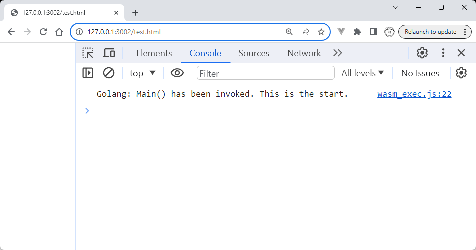

# Golang_WebAssemblyPrintLn
A sample Golang WASM sample that calls fmt.Println("Golang: Main() has been invoked. This is the start.")

You can open test.html with Live Preview in VS Code which executes the main.wasm WebAssembly.

The GoLang code executes from the WebAssembly.

```go
// +build js,wasm

package main

import (
	"fmt"
)

func main() {

	fmt.Println("Golang: Main() has been invoked. This is the start.")
}

```

## Screenshots



## Build

The main.wasm is built with the following terminal commands.

```sh
go mod init mymod
SET GOARCH=wasm
SET GOOS=js
CALL go build -o main.wasm
```
